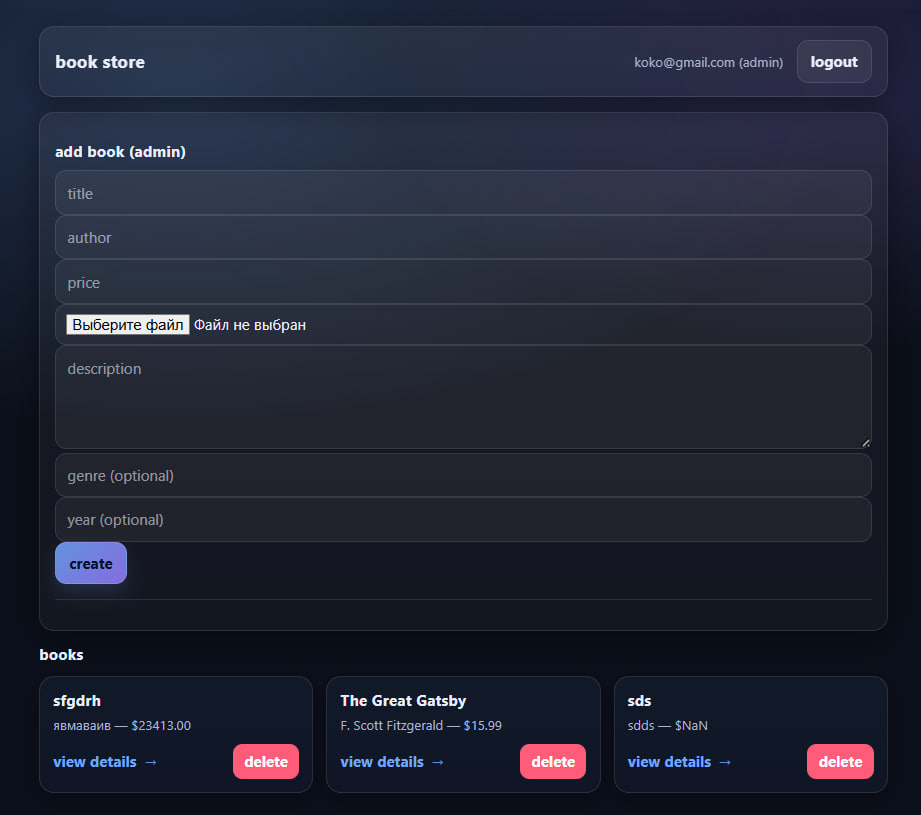
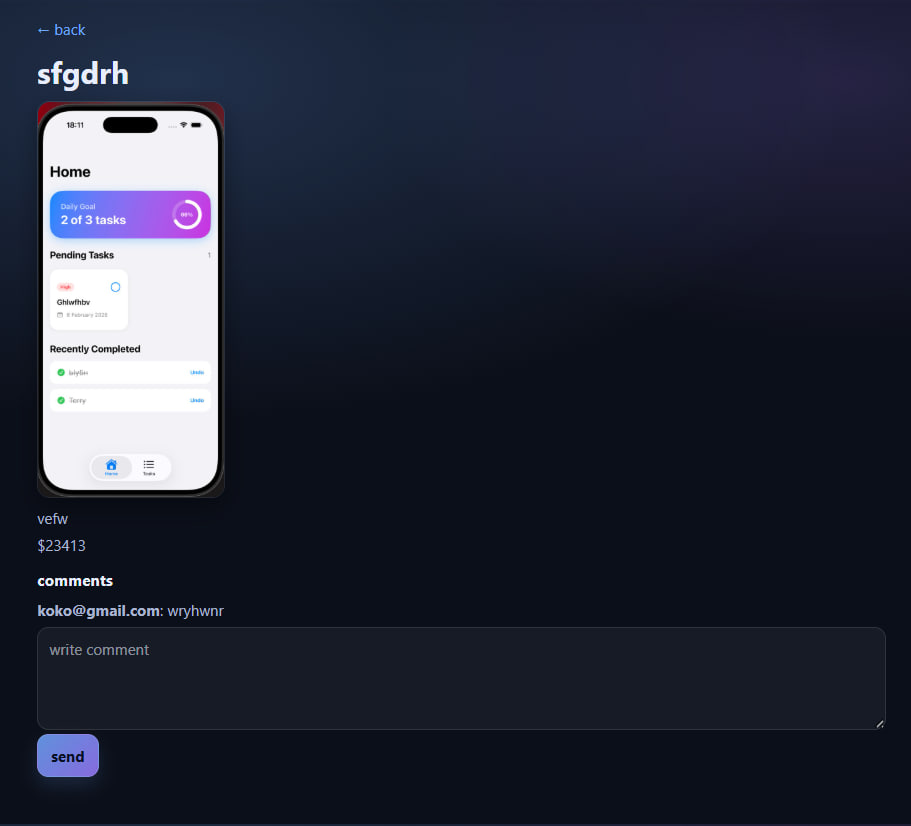

# Book API

## Simple Node.js + Express + Mongoose application implementing full CRUD for books with a basic frontend.

### Project Structure
book-api/
│

├── server.js

├── package.json

├── package-lock.json

├── .env

├── .gitignore

│

├── config/

│   └── db.js

│

├── controllers/

│   ├── authController.js

│   ├── bookController.js

│   └── commentController.js

│

├── middleware/

│   ├── authMiddleware.js

│   ├── adminMiddleware.js

│   ├── errorMiddleware.js

│   └── uploadMiddleware.js

│

├── models/

│   ├── User.js

│   ├── Book.js

│   └── Comment.js

│

├── routes/

│   ├── authRoutes.js

│   ├── bookRoutes.js

│   └── commentRoutes.js

│

├── public/

│   ├── index.html

│   ├── login.html

│   ├── register.html

│   ├── book.html

│   │

│   ├── css/

│   │   └── style.css

│   │

│   └── js/

│       ├── auth.js

│       ├── books.js

│       └── book.js

│

├── uploads/

│   └── books/

│

└── README.md

### Open the frontend in your browser:

http://localhost:5000/

## API Endpoints

POST	/api/books	Create a new book

GET	/api/books	Get all books

GET	/api/books/:id	Get a single book by ID

PUT	/api/books/:id	Update a book by ID

DELETE	/api/books/:id	Delete a book by ID

## API Examples 
 login

 register

 main page + create book (only admin) + delete book (only admin)

 view book

